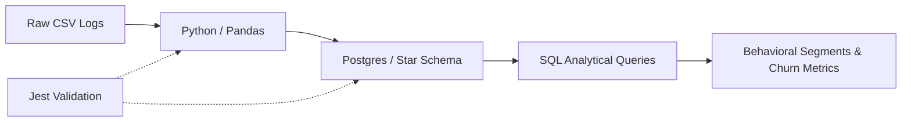

# Case Study: E-Commerce User Behavior Pipeline
## From Raw Logs to Churn Metrics: A High-Fidelity Data Architecture

### Objective
To engineer a scalable, production-ready data pipeline that transforms disparate e-commerce CSV logs into actionable behavioral intelligence, prioritizing **Data Integrity** and **Analytical Sophistication**.

---

### Architecture Diagram

*Flow: CSV -> Data Wrangling (Pandas) -> Relational Warehouse (Postgres) -> Validation (Jest) -> Behavioral Analytics.*

---

### The "Why": Technical Strategy

#### 1. Python & Pandas: High-Performance Data Wrangling
While direct database imports are possible, I chose **Python (Pandas)** for its superior data-wrangling capabilities. This stage ensures **Data Integrity** by handling:
- **Grouped Imputation**: Handling missing values based on category-specific logic.
- **Categorical-to-Ordinal Transformation**: Preparing raw labels for more advanced statistical analysis.
- **Deduplication & Type Safety**: Ensuring all numeric fields are correctly parsed before database ingestion.

#### 2. Postgres: Relational Star Schema Design
To demonstrate professional data architecture, I implemented a **Star Schema** in Postgres:
- **Fact Tables**: `fact_transactions` stores high-volume transactional data.
- **Dimension Tables**: `dim_customers`, `dim_products` store descriptive attributes.
- **Benefit**: This design optimizes query performance for complex joins, such as calculating **Customer Lifetime Value (CLV)** and **Churn Latency**.

#### 3. Jest: Proving Production-Ready Reliability
In a senior engineering environment, code that isn't tested doesn't belong in production. I integrated **Jest** to:
- Validate that the data transformation logic matches expected outputs.
- Ensure that the pipeline can gracefully handle edge cases (e.g., zero-revenue transactions).
- Prove that the entire system is **testable** and maintainable by any engineering team.

---

### Analytical Outcome: Behavioral Intelligence
The final pipeline doesn't just "show data"—it identifies **Behavioral Rhythms**. By segmenting users into **VIP** vs. **Standard** and detecting **Churn Risk** before it happens, the system provides the "Predictive Edge" necessary for high-fidelity business decisions.
